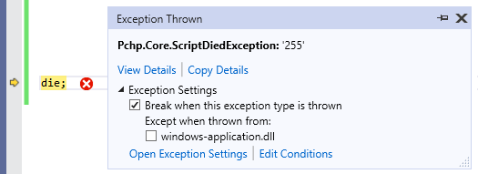

# ScriptDiedException

<small>**assembly:** Peachpie.Runtime.dll</small> 
<small>**inherits:** `PhpErrorException`, `System.Exception`</small>

`ScriptDiedException` is thrown to simulate PHP's `die` and `exit` constructs. This is a well-known exception that is thrown by design and can thus be ignored in your development environment. The exception supposes to be thrown and will be safely handled.

## Properties

Property | Description
---      | ---
Status | Original argument passed to the `die` function. If no argument is provided, the property is set to a number `255` according to PHP semantics.
ExitCode | `Status` as a number. Gets `0` if `Status` is not a number.
Message | `Status` converted to a string.

## Debugging ScriptDiedException

When `exit` or `die` commands are being debugged, they might result in the debugger to break on `Pchp.Core.ScriptDiedException`.

*Exception handled in Visual Studio.*

It is recommended to ignore the exception (Untick `Break when this exception type is thrown` in Visual Studio, or similarly in other development environments).

## Remarks

The exception is thrown as a response to the `die` and `exit` constructs. The reason is that this is the only way how to terminate the program at the current location without any unnnecesary overhead. 

Since it is a CLR exception, it is always handled by the .NET debugger and by the eventual `catch` constructs. This can be used in a C# application to handle `die` in PHP code without terminating the request.

PHP's `try`/`catch` constructs are translated into corresponding CLR code respecting `ScriptDiedException` and re-throwing it away. By default, the request handler catches the exception in order to simulate PHP's `die` behavior of outputing the status message.
