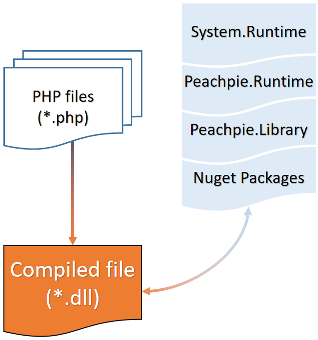

# Get Started

Peachpie consists of three components:
- The compiler (**peach.exe** for .NET Framework 4.6 or **Peachpie.NET.Sdk** when using [[msbuild]]) builds regular .NET assemblies with PDB information from the given PHP files.
- The runtime (**Peachpie.Runtime.dll**) containing the functionality that is required by the compiled assembly while running.
- The libraries (**Peachpie.Library.dll** and others) containing the implementation of PHP functions, classes, constants etc.



The compiler targets both major platforms - **.NET Core** 1.1+ and **Full .NET Framework** 4.6 - which makes Peachpie compiled programs available on Windows, Windows Core, Windows Phone, Linux, MacOS and platforms supported by Xamarin (Android, iOS).

For a brief overview of how to build Peachpie on the command line or how to use it in Visual Studio Code, please refer to the following videos:

- [Command line building](https://www.youtube.com/watch?v=GVWVInYiYLY)
- [Visual Studio Code](https://youtu.be/hBiixbockK4)

## A. MSBuild

Using the [[MSBuild]] project is the recommended approach of compiling source files. See the sections below for getting started with various project types.

### Before you start

- Install [.NET Core 2.0 SDK](https://www.microsoft.com/net/core) for your platform.
- Optionally - Visual Studio Code ([VSCode](https://code.visualstudio.com/) + [C# Extension](https://marketplace.visualstudio.com/items?itemName=ms-vscode.csharp) + [Peachpie Extension](https://marketplace.visualstudio.com/items?itemName=iolevel.peachpie-vscode)) or Visual Studio 2017 ([VS2017](https://www.visualstudio.com/downloads/)).
- Create an [[msbuild project file|msbuild]] within the project directory containing PHP files.

### (a) CommandLine .NET Core Application

1. Update the [[msbuild project file|msbuild]] with the following properties
```xml
<PropertyGroup>
    <OutputType>exe</OutputType>
    <TargetFramework>netcoreapp2.0</TargetFramework>
    <StartupObject>main.php</StartupObject>
</PropertyGroup>
```

2. Restore the project dependencies, either in the IDE or using the following command:

`dotnet restore`

3. Build the project:

`dotnet build` or `msbuild /t:build project.msbuildproj`

### (b) Class Library

1. Update the [[msbuild project file|msbuild]] with the following properties
```xml
<PropertyGroup>
    <OutputType>library</OutputType>
    <TargetFrameworks>net46;netstandard1.5</TargetFrameworks>
</PropertyGroup>
```

2. Restore the project dependencies, either in the IDE or using the following command:

`dotnet restore`

3. Build the project:

`dotnet build` or `msbuild /t:build project.msbuildproj`

### (c) Android/iOS App

*In progress*

### (d) ASP.NET Core WebSite

See the [ASP.NET Core & Kestrel](https://github.com/iolevel/peachpie-samples/tree/master/web-application) sample project for more details.

### (e) ASP.NET WebSite

This type of project requires you to compile Peachpie from the sources to get `Peachpie.RequestHandler.dll`. Then follow the steps below:

1. Compile the PHP project as a class library targeting `net46`
```xml
<PropertyGroup>
    <OutputType>library</OutputType>
    <TargetFrameworks>net46</TargetFrameworks>
</PropertyGroup>
```

2. Copy the resulting `dll`, `Peachpie.RequestHandler.dll` and other dependent assemblies (`Peachpie.Runtime.dll`, `Peachpie.Library.dll`) to the `/bin/` directory.


3.  Configure the `web.config` file in the Web Application root with the following code:
```xml
<?xml version="1.0" encoding="UTF-8"?>
<configuration>
  <system.webServer>
    <handlers>
      <add name="PhpHandler" path="*.php" verb="*" type="Peachpie.RequestHandler.RequestHandler, Peachpie.RequestHandler" preCondition="integratedMode" />
    </handlers>
  </system.webServer>
</configuration>
```

## B. In-Memory Compilation

See [Scripting Test](https://github.com/iolevel/peachpie/blob/master/src/Tests/Peachpie.Test/Program.cs) for a sample utilization of the Peachpie API.

## C. CommandLine Compiler

See [[peach.exe]] for the standalone compiler tool. The tool targets the full .NET Framework only.
